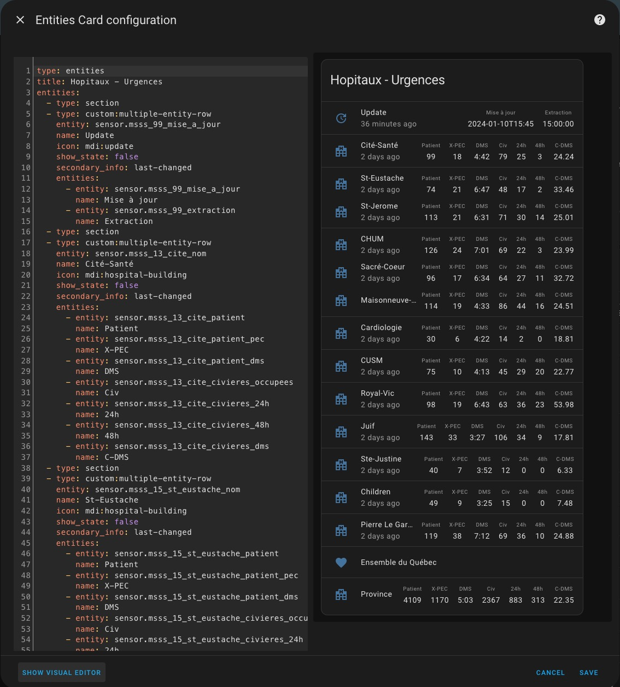
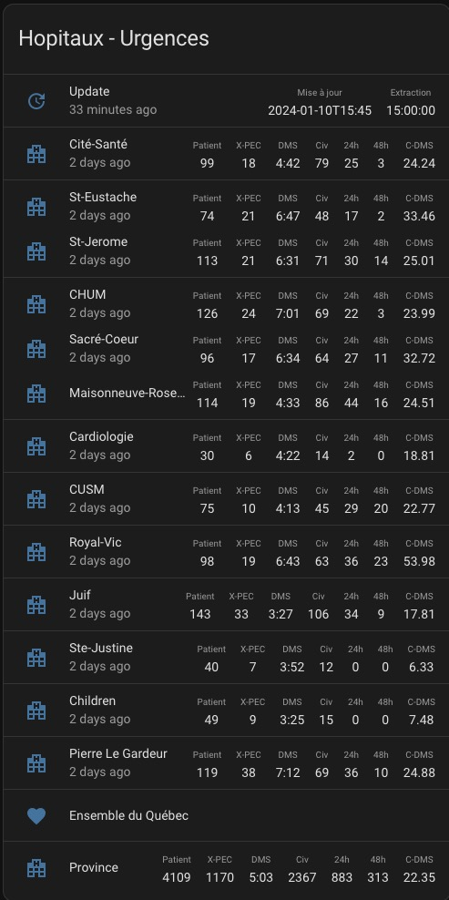

#  MSSS Urgences

Ce répertoire inclut une première carte pour afficher les données du ministère de la Santé et des Services sociaux relativement à l'état d'occupation des urgences.

## Carte Multiple entity row

### Installation

- Installer [multiple-entity-row](https://github.com/benct/lovelace-multiple-entity-row) depuis le HACS.
- Au préalable, vous devrez ajouter les sensors pour les établissements que vous voulez suivre dans le fichier de configuration **configuration.yaml**.
- Copier le contenu du fichier [entity-row.yaml](entity-row.yaml) dans une carte de votre Dashboard via le bouton "SHOW CODE EDITOR". Ajuster le contenu selon les sensors que vous avez créés précédemment.

  

**Exemple d'une carte de type multiple-entity-row**

- **Patient** indique : Nombre de patient à l'urgence
- **X-PEC** indique : Patient non Prise En Charge
- **DMS** indique : Durée moyenne du séjour à l'urgence.
- **Civ** indique : Nombre de civières à l'urgence.
- **24h** indique : Nombre de patient sur civière depuis 24 heures.
- **48h** indique : Nombre de patient sur civière depuis 24 heures.
- **C-DM** indique : Durée Moyenne du séjour sur civière.

  
