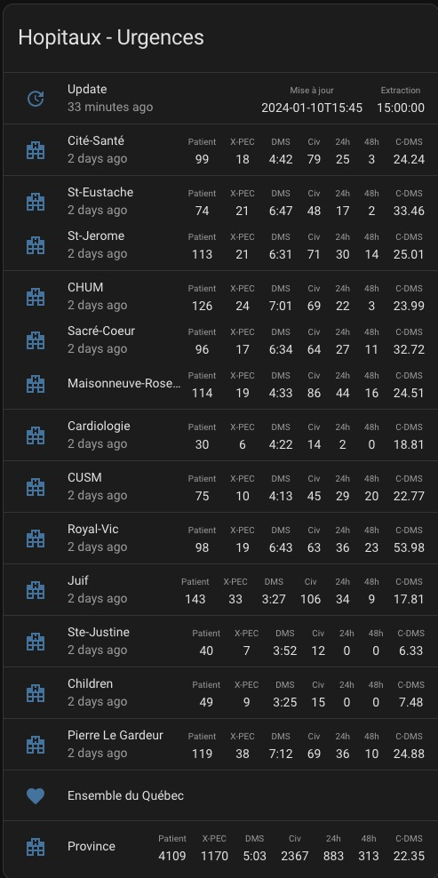

#  MSSS Urgences

Ce répertoire inclut une première carte pour afficher les données du ministère de la Santé et des Services sociaux relativement à l'état d'occupation des urgences.

## Carte Multiple entity row

### Installation

- Installer [multiple-entity-row](https://github.com/benct/lovelace-multiple-entity-row) depuis le HACS.
- Au préalable, vous devrez ajouter les sensors pour les établissements que vous voulez suivre dans le fichier de configuration **configuration.yaml**.
- Copier le contenu du fichier [msss_urgences_multiple_entity_row_card.yaml](msss_urgences_multiple_entity_row_card.yaml) dans une carte de votre Dashboard via le bouton "SHOW CODE EDITOR". Ajuster le contenu selon les sensors que vous avez créées précédemment.

  

- Exemple d'entités pour un Multiple Entity Row :
 
 ```
type: entities
title: Hopitaux - Urgences
entities:
  - type: section
  - type: custom:multiple-entity-row
    entity: sensor.msss_99_mise_a_jour
    name: Update
    icon: mdi:update
    show_state: false
    secondary_info: last-changed
    entities:
      - entity: sensor.msss_99_mise_a_jour
        name: Mise à jour
      - entity: sensor.msss_99_extraction
        name: Extraction
  - type: section
  - type: custom:multiple-entity-row
    entity: sensor.msss_13_cite_nom
    name: Cité-Santé
    icon: mdi:hospital-building
    show_state: false
    secondary_info: last-changed
    entities:
      - entity: sensor.msss_13_cite_patient
        name: Patient
      - entity: sensor.msss_13_cite_patient_pec
        name: X-PEC
      - entity: sensor.msss_13_cite_patient_dms
        name: DMS
      - entity: sensor.msss_13_cite_civieres_occupees
        name: Civ
      - entity: sensor.msss_13_cite_civieres_24h
        name: 24h
      - entity: sensor.msss_13_cite_civieres_48h
        name: 48h
      - entity: sensor.msss_13_cite_civieres_dms
        name: C-DMS
  - type: section
  - type: custom:multiple-entity-row
    entity: sensor.msss_99_region
    name: Ensemble du Québec
    icon: mdi:heart
    show_state: false
  - type: section
  - type: custom:multiple-entity-row
    entity: sensor.msss_99_nom
    name: Province
    icon: mdi:hospital-building
    show_state: false
    entities:
      - entity: sensor.msss_99_patient
        name: Patient
      - entity: sensor.msss_99_patient_pec
        name: X-PEC
      - entity: sensor.msss_99_patient_dms
        name: DMS
      - entity: sensor.msss_99_civieres_occupees
        name: Civ
      - entity: sensor.msss_99_civieres_24h
        name: 24h
      - entity: sensor.msss_99_civieres_48h
        name: 48h
      - entity: sensor.msss_99_civieres_dms
        name: C-DMS
```

**Exemple d'une carte de type multiple-entity-row**

- **Patient** indique : Nombre de patient à l'urgence
- **X-PEC** indique : Patient non Prise En Charge
- **DMS** indique : Durée moyenne du séjour à l'urgence.
- **Civ** indique : Nombre de civières à l'urgence.
- **24h** indique : Nombre de patient sur civière depuis 24 heures.
- **48h** indique : Nombre de patient sur civière depuis 24 heures.
- **C-DM** S indique : Durée Moyenne du Séjour sur civière.


  
